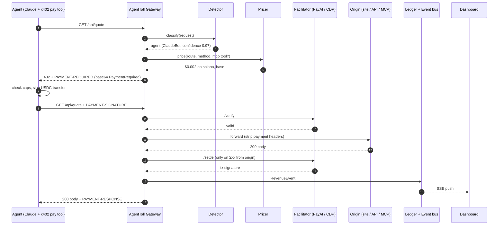
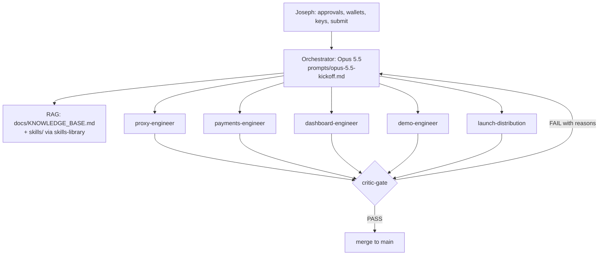

# AgentToll Architecture

Two architectures live here:

1. **Runtime architecture**: what AgentToll is when it runs.
2. **Build-agent architecture**: the Claude agent org that builds it before Oct 12.

---

## Part 1: Runtime architecture

### 1.1 Request flow



Humans: step 2 returns `human`, the gateway forwards immediately. No 402, no added latency beyond the proxy hop.

### 1.2 Components

| Component | Tech | Responsibility | Interface |
|---|---|---|---|
| `agenttoll-gateway` | Rust: axum, hyper, tower, tokio, `x402-axum`, `x402-chain-solana` | Reverse proxy, x402 challenge/verify/settle, header hygiene, streaming bodies | HTTP on `:8402`; admin API on `:8403` |
| `detector` (module) | Rust | Human vs agent classification | `fn classify(&Request) -> Verdict { kind, agent_name, confidence, reason }` |
| `pricer` (module) | Rust, `serde_yaml`, `globset` | Route + MCP tool price lookup, per-chain requirements | `fn price(&Request, Option<McpCall>) -> Option<PriceTag>` |
| `mcp` (module) | Rust, `serde_json` | Parse MCP Streamable HTTP JSON-RPC bodies; extract `tools/call` name; price per tool; leave `initialize`, `tools/list` free | `fn inspect(body) -> Option<McpCall>` |
| `ledger` | SQLite (dev) via `sqlx`, Postgres/Supabase (prod) | Append-only revenue events, idempotent on tx signature | `revenue_events` table |
| `events` | tokio broadcast + SSE endpoint `/admin/events` | Live feed to dashboard | `text/event-stream` |
| `agenttoll-edge` | Cloudflare Worker, Hono, `@x402/hono`, `@x402/svm`, `@x402/evm`, D1 | Same contract at the edge | Worker route |
| `dashboard` | Next.js (App Router), Tailwind, shadcn/ui, Recharts | Revenue totals, by route / agent / chain, live settlements, explorer links | Reads admin API + SSE |
| `buyer` (demo) | Rust `x402-reqwest` CLI + TypeScript MCP server exposing `pay_and_fetch(url, max_usd)` | Demo client and Claude's payment tool | stdio MCP |

### 1.3 Detection policy

Ordered, first match wins. Output is a `Verdict` with a `reason` that is logged and shown on the dashboard.

1. Request carries `PAYMENT-SIGNATURE` → **agent** (it is trying to pay).
2. Path matches `mcp.endpoint` → **agent** (MCP clients are agents by definition).
3. Valid **Web Bot Auth** HTTP Message Signature (`Signature`, `Signature-Input`, `Signature-Agent`) → **agent**, named by key directory.
4. User-Agent in the verified-bot list (GPTBot, ClaudeBot, Claude-User, PerplexityBot, OAI-SearchBot, Google-Extended, CCBot, Bytespider, Amazonbot, etc.) → **agent**.
5. Heuristics: no `Accept-Language`, `Accept: */*` or `application/json` on an HTML route, missing `sec-fetch-*` headers, headless UA tokens → **agent** with confidence < 0.8 (only charged when `detection: all-requests` or `strict`).
6. Otherwise → **human**.

Modes: `agents-only` (default), `all-requests` (pure API monetization), `off` (pass-through, logging only).

### 1.4 Payment contract (x402 v2)

- Challenge: HTTP `402`, header `PAYMENT-REQUIRED` = base64(JSON `PaymentRequired`), one `accepts[]` entry per chain:
  - Solana: `scheme: "exact"`, `network: "solana:<genesis-hash>"` (CAIP-2), asset = USDC mint, `payTo` = founder account, amount in base units (USDC has 6 decimals, so $0.002 = `2000`).
  - Base: `scheme: "exact"`, `network: "eip155:8453"` (Base Sepolia `eip155:84532` for dev), asset = USDC contract, EIP-3009 authorization.
- Retry: client sends `PAYMENT-SIGNATURE` = base64(`PaymentPayload`).
- Gateway calls facilitator `/verify` → forwards to origin → on origin 2xx calls `/settle` → returns `PAYMENT-RESPONSE` = base64(settlement JSON, includes tx signature).
- Origin non-2xx → do **not** settle; return origin status; the agent is not charged.
- Idempotency: ledger unique key on `(network, tx_signature)`; replays rejected by facilitator nonce rules.

Exact header names, CAIP-2 IDs, mint addresses and facilitator URLs are pinned in [`docs/KNOWLEDGE_BASE.md`](docs/KNOWLEDGE_BASE.md). Verify them against the current `coinbase/x402` specs before coding; never guess.

### 1.5 One spendable account

- Solana is home. `accounts.solana` is the founder's wallet; USDC lands in its associated token account.
- Base earnings land in `accounts.base`. Optional sweeper job bridges to Solana with Circle CCTP on a threshold (stretch goal, not demo-critical).
- AgentToll never holds keys or funds. Non-custodial by design.

### 1.6 Data model

```sql
CREATE TABLE revenue_events (
  id            INTEGER PRIMARY KEY,
  ts            TIMESTAMP NOT NULL,
  route         TEXT NOT NULL,
  mcp_tool      TEXT,
  agent_name    TEXT,
  detect_reason TEXT NOT NULL,
  network       TEXT NOT NULL,      -- CAIP-2
  asset         TEXT NOT NULL,
  amount_atomic BIGINT NOT NULL,    -- 6-decimal USDC base units
  payer         TEXT,
  tx_signature  TEXT NOT NULL,
  origin_status INTEGER NOT NULL,
  latency_ms    INTEGER NOT NULL,
  UNIQUE (network, tx_signature)
);
CREATE TABLE request_log (           -- unpaid traffic, for "agent traffic you are not billing yet"
  ts TIMESTAMP, route TEXT, verdict TEXT, agent_name TEXT, reason TEXT, status INTEGER
);
```

### 1.7 Repo layout (target)

```
agenttoll/
├── Cargo.toml                    # workspace
├── crates/
│   ├── agenttoll-gateway/        # bin: proxy + admin API
│   ├── agenttoll-core/           # detector, pricer, mcp, config types (no IO)
│   └── agenttoll-buyer/          # bin: x402-reqwest demo client
├── workers/agenttoll-edge/       # Cloudflare Worker edition
├── apps/dashboard/               # Next.js revenue dashboard
├── demo/
│   ├── origin/                   # tiny origin API (/api/quote, /blog, /mcp)
│   └── pay-mcp/                  # MCP server: pay_and_fetch with caps
├── agenttoll.example.yaml
├── docs/  prompts/  skills/  .claude/agents/  scripts/
└── docker-compose.yml            # origin + gateway + dashboard
```

### 1.8 Non-functional targets

| Target | Number |
|---|---|
| Added latency, human path | < 5 ms p50 |
| Added latency, paid path (excluding facilitator) | < 20 ms p50 |
| Gateway memory | < 50 MB idle |
| Config reload | hot, on SIGHUP or file change |
| Tests | detector + pricer unit tests, one end-to-end devnet test in CI behind a secret |

---

## Part 2: Build-agent architecture

One orchestrator, six specialists, one gate. Agents draft and build; Joseph approves anything that spends real money, publishes, or submits.



| Agent | File | Owns | Skills loaded | Done when |
|---|---|---|---|---|
| **Orchestrator** | `prompts/opus-5.5-kickoff.md` | Plan, task graph, delegation, integration, ROADMAP status | `skills-library`, `skillbox-router`, all as needed | Demo runs end to end and submission checklist is green |
| **proxy-engineer** | `.claude/agents/proxy-engineer.md` | `agenttoll-core`, `agenttoll-gateway`, `agenttoll-edge` | `agenttoll-proxy-rust`, `agent-detection`, `paid-mcp-tools`, `x402-protocol` | Human passes, agent gets 402, paid request forwarded, tests green |
| **payments-engineer** | `.claude/agents/payments-engineer.md` | Facilitator client, Solana + Base requirements, ledger writes, settlement rules | `x402-protocol`, `solana-usdc-settlement` | Devnet USDC settles and tx sig is stored |
| **dashboard-engineer** | `.claude/agents/dashboard-engineer.md` | `apps/dashboard`, admin API contract, SSE | `revenue-dashboard` | Live event appears < 1 s after settlement |
| **demo-engineer** | `.claude/agents/demo-engineer.md` | `demo/origin`, `demo/pay-mcp`, `agenttoll-buyer`, recording script | `claude-buyer-demo`, `x402-protocol` | Claude pays $0.002 and shows the data on camera |
| **launch-distribution** | `.claude/agents/launch-distribution.md` | Submission copy, video script, X/LinkedIn build-in-public posts, README polish | `colosseum-submission`, `hackathon-distribution` | Drafts ready for Joseph; nothing posted without approval |
| **critic-gate** | `.claude/agents/critic-gate.md` | Review every change against acceptance criteria, security, and the spec | `critic-gate`, `x402-protocol` | Returns PASS or FAIL with file:line reasons |

### 2.1 Operating rules for every agent

1. **Retrieve before you write.** Look up facts in `docs/KNOWLEDGE_BASE.md` (by chunk ID) and the relevant `skills/*/SKILL.md`. If a fact is missing or marked `VERIFY`, check the upstream source and update the KB with a citation before relying on it.
2. **Devnet and testnet only** unless Joseph explicitly approves mainnet. Never commit keys; use `.env` (gitignored).
3. **Small vertical slices.** Each PR delivers one runnable behavior with a test.
4. **Critic gate before merge.** No self-merge.
5. **Log decisions** in `docs/DECISIONS.md` (date, decision, why, alternatives).
6. **Ask Joseph** for: wallets/keys, any spend, any public post, the final submit.

### 2.2 Context strategy (why this is RAG-shaped)

- Always-loaded context is small: `AGENTS.md` + the kickoff prompt.
- Facts live in `docs/KNOWLEDGE_BASE.md` as short, ID'd chunks (`KB-X402-01`) with sources, so agents can grep or embed them and cite IDs in code comments and PRs.
- Procedures live in `skills/`, loaded on demand by description match (progressive disclosure), never pasted into memory.
- External packs (Skillbox, distribution-playbook) are imported locally with `scripts/import-skills.sh` and routed by `skillbox-router`.
