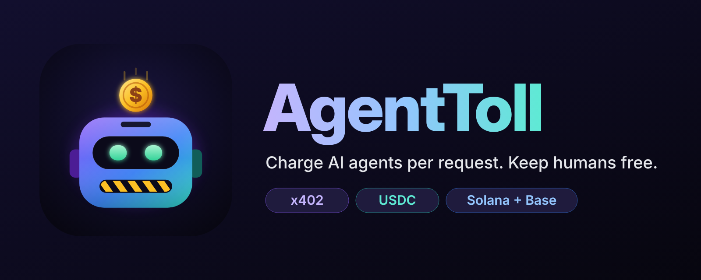
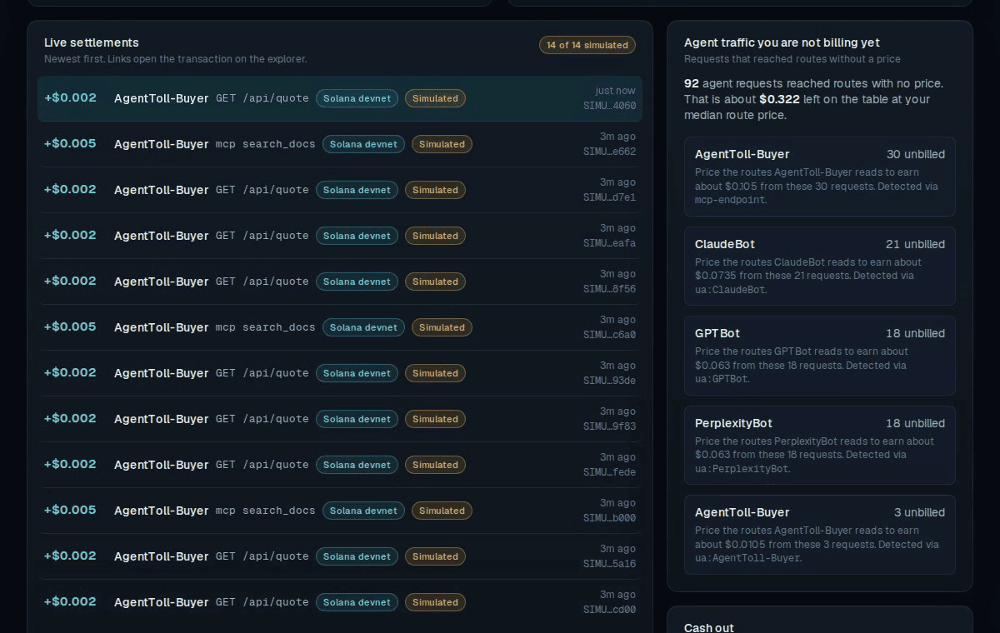
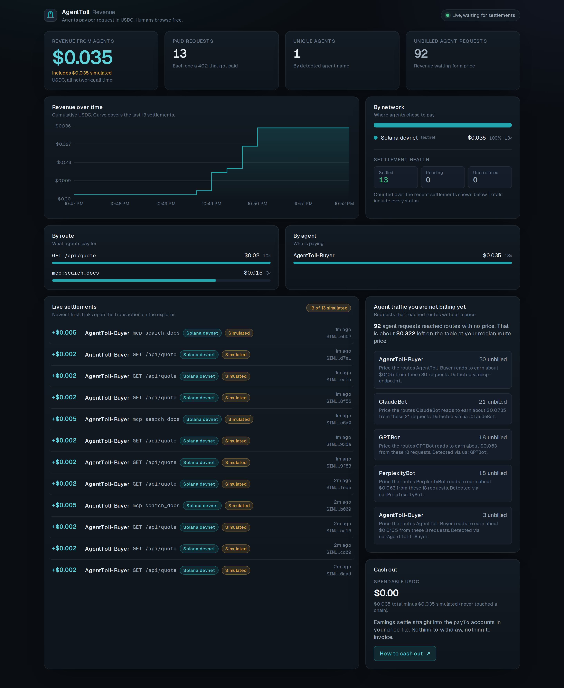

<p align="center"></p>

# AgentToll

**Charge AI agents per request. Keep humans free.**

<p align="center"></p>

<p align="center"></p>

Both captures come from the real local stack (`bash scripts/demo-local.sh`). The payments shown are simulated settlements through the local test facilitator: no funds moved and nothing went on chain. More captures and how they were made: [docs/assets/README.md](docs/assets/README.md).

AgentToll is an open-source paywall proxy. Put it in front of a site, an API or an MCP server, set a price per route or per MCP tool, and AI agents pay per call in USDC over [x402](https://github.com/x402-foundation/x402). Humans keep browsing for free. There are no API keys, signups or invoices. Payments settle on Solana (Base as a second rail) straight into the founder's own wallet: AgentToll never holds funds.

> Agents already use your product. Now you can bill them.

Built for the [Colosseum Crypto World's Fair](https://colosseum.com/worldsfair) (Sep 14 to Oct 12, 2026). Tracks: **Solana** (primary), **Base**.

## Who it is for

| You are | AgentToll gives you |
|---|---|
| **A founder with an API or data** | A price per call that any agent can pay instantly, no key issuing or billing system |
| **A publisher or docs site** | Agents pay to read; people read free; a report of the agent traffic you are not billing yet |
| **An MCP server author** | Per-tool prices; `initialize` and `tools/list` stay free; native x402 payments inside MCP calls |
| **An agent (or the person running one)** | `pay-mcp`: a wallet for Claude with hard per-call and per-day caps, plus a price list at `/.well-known/agenttoll.json` |

Seven worked cases with configs and proofs: [docs/USE_CASES.md](docs/USE_CASES.md).

## Try it in one command (no wallet, no funds)

You need a Rust toolchain (`rustup`, stable), `curl` and `python3`. No Docker, no wallet, no keys. The first run compiles the workspace, about 400 crates: 14 minutes on a shared 4-core server limited to 2 build jobs (measured 2026-10-04), faster on a laptop. Later runs start in seconds.

```bash
bash scripts/demo-local.sh
```

Ports are 8402 (gateway), 8403 (admin), 4000 (origin) and 4020 (simulated facilitator). If one is taken, set `GATEWAY_PORT`, `ADMIN_PORT`, `ORIGIN_PORT` or `FACILITATOR_PORT`.

The script builds the stack and walks through it:

1. A human gets the page free.
2. An AI crawler gets `402` with a price quote.
3. An agent reads the price list.
4. The buyer CLI pays $0.002 and gets the data.
5. An MCP client gets a native x402 challenge for a paid tool.
6. `tools/list` shows each tool's price.
7. Crawler traffic on free pages is logged as "not billing yet".
8. The founder's ledger shows it all.

The demo settles through a **simulated facilitator** (`demo/mock-facilitator`). Every simulated payment carries a `SIMULATED-` id and is labelled as simulated by the gateway, dashboard, buyer and pay-mcp. Nothing touches a chain and nothing is ever shown as on-chain. To take real devnet payments, see [Real devnet payments](#real-devnet-payments).

Keep the stack running and open the dashboard (`STACK_ONLY=1` instead starts the stack with an empty ledger and skips the walkthrough):

```bash
KEEP=1 bash scripts/demo-local.sh
# in another shell, with the token the script prints:
cd apps/dashboard && pnpm install
AGENTTOLL_ADMIN_URL=http://127.0.0.1:8403 AGENTTOLL_ADMIN_TOKEN=<token> pnpm dev
```

See Claude pay: with the stack running (`STACK_ONLY=1`), build `demo/pay-mcp` and run `bash scripts/claude-pays-demo.sh`. The headless Claude CLI finds a price, pays it within its caps, gets refused on a $0.05 tool and pays for an MCP tool. Transcript with every tool call: [docs/assets/claude-pays-transcript.md](docs/assets/claude-pays-transcript.md). All payments are simulated.

Or run everything in containers: `cp .env.example .env`, fill in the three `AGENTTOLL_*` values, then `docker compose up --build`.

## How it works

```
Agent ──GET /api/quote──────────────▶ AgentToll ──▶ 402 + PAYMENT-REQUIRED ($0.002 USDC, Solana devnet)
Agent ──signs a USDC transfer (pay-mcp caps: $0.01/call, $0.25/day)
Agent ──GET /api/quote + PAYMENT-SIGNATURE──▶ AgentToll ──/verify──▶ facilitator
                                              AgentToll ──forward──▶ origin ──200──▶ AgentToll ──/settle──▶ facilitator
Agent ◀── 200 + data + PAYMENT-RESPONSE (settlement signature)
Dashboard ◀── SSE: +$0.002 · ClaudeBot · GET /api/quote · Solana devnet
```

| Piece | What it does |
|---|---|
| **Gateway** (`crates/agenttoll-gateway`, Rust) | Reverse proxy. Classifies each request (human, agent, search bot, MCP client), prices it, answers unpaid agent requests with an x402 v2 `402`, verifies payments with a facilitator, forwards, settles, records revenue, streams it to the dashboard. |
| **Core** (`crates/agenttoll-core`) | Pure rules shared by every edition: config, detector, path canonicalization, pricer, MCP inspection, money. |
| **Worker edition** (`workers/agenttoll-edge`) | The same gateway as a Cloudflare Worker. The core compiles to WebAssembly, so detection and pricing are identical; parity tests prove the Worker and the Rust gateway return byte-identical quotes. |
| **Dashboard** (`apps/dashboard`, Next.js) | Revenue, by route, by agent and by network; a live settlement feed; unbilled agent traffic with pricing suggestions; cash out. |
| **pay-mcp** (`demo/pay-mcp`) | An MCP server that gives Claude Desktop, Claude Code or any MCP client a USDC wallet with hard caps: `get_quote`, `pay_and_fetch`, `call_paid_tool`, `spend_status`. |
| **Buyer CLI** (`crates/agenttoll-buyer`) | Pays an x402 URL from the command line on Solana devnet or Base Sepolia. |

Full design: [ARCHITECTURE.md](ARCHITECTURE.md). Every design decision with its reason: [docs/DECISIONS.md](docs/DECISIONS.md).

## Money rules

- **Humans never pay.** In the default `agents-only` mode only agents that identify themselves (AI crawler user agents, MCP clients, anyone presenting a payment) are charged; guesses (curl, headless browsers) are logged, not billed. Cryptographic Web Bot Auth verification is on the roadmap, not built.
- **Agents never pay for errors.** Settlement happens only after the origin succeeds. For MCP, a tool that errors (JSON-RPC error or `isError`) is never charged, and a result the gateway cannot verify is withheld rather than given away.
- **Content only after settlement.** If the facilitator rejects the payment, the agent gets the 402, not the content. If settlement times out after the origin answered, the content is served and the payment is recorded as `unconfirmed`, so nobody is charged without service and nothing goes unrecorded.
- **One payment, one resource.** Payments are checked against the gateway's own quote (amount, asset, recipient, network), bound to the resource and tool they were quoted for, and refused if replayed.
- **Non-custodial.** Funds go straight to your `pay_to`. AgentToll holds no keys and no money.

## Price file

```yaml
origin: https://your-site.example
listen: 0.0.0.0:8402
admin_listen: 127.0.0.1:8403        # dashboard API; needs AGENTTOLL_ADMIN_TOKEN (24+ chars)
public_url: https://api.your-site.example
detection: agents-only              # agents-only | all-requests | off

networks:
  solana:
    network: "solana:EtWTRABZaYq6iMfeYKouRu166VU2xqa1"   # Solana devnet
    asset: "4zMMC9srt5Ri5X14GAgXhaHii3GnPAEERYPJgZJDncDU" # devnet USDC
    pay_to: "${AGENTTOLL_SOLANA_PAYTO}"                   # your wallet or payout address
    facilitator: "https://facilitator.payai.network"

routes:                             # first match wins; unmatched is free
  - match: "GET /api/quote"
    price_usd: "0.002"
  - match: "GET /blog/*"
    price_usd: "0.001"
  - match: "/*"
    price_usd: "0"

mcp:
  endpoint: /mcp
  advertise_prices: true            # show prices in tools/list
  tools:
    search_docs: "0.005"
    generate_report: "0.05"
```

Prices are quoted strings (`"0.002"`); the money path is integer-only. The full example is [agenttoll.example.yaml](agenttoll.example.yaml).

## For agents

- **Find prices first:** `GET /.well-known/agenttoll.json` lists every route, tool, price, network and payment transport.
- **Claude:** add `pay-mcp` to Claude Desktop or Claude Code ([demo/pay-mcp/README.md](demo/pay-mcp/README.md)). It refuses before signing anything above your caps, anything that is not USDC on an allowed network, and non-http(s) URLs. It counts every payment it has signed and sent.
- **Any MCP client:** paid tools answer with the x402 MCP transport. The client retries with `params._meta["x402/payment"]` and the receipt comes back in `result._meta["x402/payment-response"]`.
- **Scripts and pipelines:** `cargo run -p agenttoll-buyer -- <url> --network solana`.

## Real devnet payments

1. Create two devnet wallets: `agenttoll-buyer --new-solana-keypair buyer.json` and the same for `payto.json`. Each command prints the address.
2. Fund **both** addresses with devnet USDC at [faucet.circle.com](https://faucet.circle.com) (Solana Devnet). Funding `pay_to` also creates its USDC account. No SOL is needed; the facilitator pays fees.
3. Use `agenttoll.example.yaml` (facilitator `https://facilitator.payai.network`), then run `agenttoll-buyer <url>`. It prints the Solana Explorer link for the settlement.

## Getting paid out

Earnings land in the `pay_to` address you choose: a self-custody wallet, a stablecoin business account, or an off-ramp deposit address that converts USDC to dollars in your bank. AgentToll stays non-custodial. Native off-ramp partner integrations are on the roadmap. See [docs/PAYOUTS.md](docs/PAYOUTS.md).

## Status

Hackathon build, devnet and testnet only. Each part is built as a separate pull request and reviewed by an independent adversarial critic agent before merge:

| Part | Tests |
|---|---|
| Rust gateway + core + buyer + demo stack | 87 |
| pay-mcp | 69 |
| Worker edition (17 are parity tests against the Rust gateway) | 52 |
| Dashboard | typecheck, lint, build, Playwright checks |

Plan and progress: [docs/ROADMAP.md](docs/ROADMAP.md).

## Repo map

| Path | Purpose |
|---|---|
| `crates/` | Rust core, gateway, buyer, WASM facade |
| `apps/dashboard/` | Founder dashboard |
| `demo/` | Demo origin, simulated facilitator, pay-mcp, demo config |
| `workers/agenttoll-edge/` | Cloudflare Worker edition |
| `scripts/demo-local.sh` | One-command demo |
| `docker-compose.yml`, `Dockerfile`, `deploy/` | Container stack |
| [`docs/`](docs) | Knowledge base (cited facts), decisions, roadmap, use cases, payouts, admin API, submission |
| [`AGENTS.md`](AGENTS.md), [`skills/`](skills), [`.claude/agents/`](.claude/agents) | How the AI build team works on this repo |

## Credits

x402 protocol and SDKs: [x402-foundation/x402](https://github.com/x402-foundation/x402). Rust x402 client: [x402-rs](https://github.com/x402-rs/x402-rs). Skill library pattern: [Skillbox](https://github.com/kitze/skillbox) (MIT).

## License

MIT. Built by Joseph Clark ([@Josefusan](https://github.com/Josefusan)).
